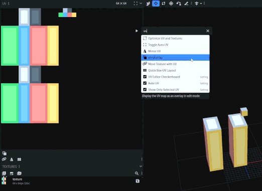

# bb-uv-optimizer

Blockbench plugin for optimizing UV textures.

- [Rectangle Packing](https://en.wikipedia.org/wiki/Rectangle_packing)

## Features

- Optimize UV textures
- Can be undone (requires performing undo around 3 times since it's a complex process)
- Automatically converts from Box UV to Per-face UV
- Removes similar texture UVs within the threshold
- Support for multiple texture variants
- Support for animated textures
- Adjustable padding to prevent bleeding
